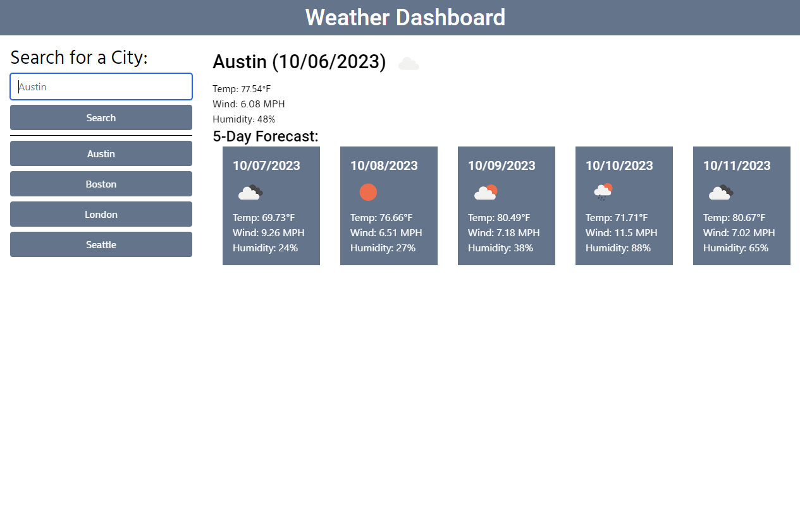

# Weather Dashboard

## Description

A website that lets you view the current weather, and the weather for the next 5 days.

Any location you enter is automatically added to a sidebar, and you can click them to view updated data.

# Usage

To use this project, you may view the live website [here](https://ashoener.github.io/weather-dashboard/).

Click on the search box to search for a city. Click "Search," and the page will load the weather information.

## License

Please refer to the [LICENSE](/LICENSE) in the repo.
